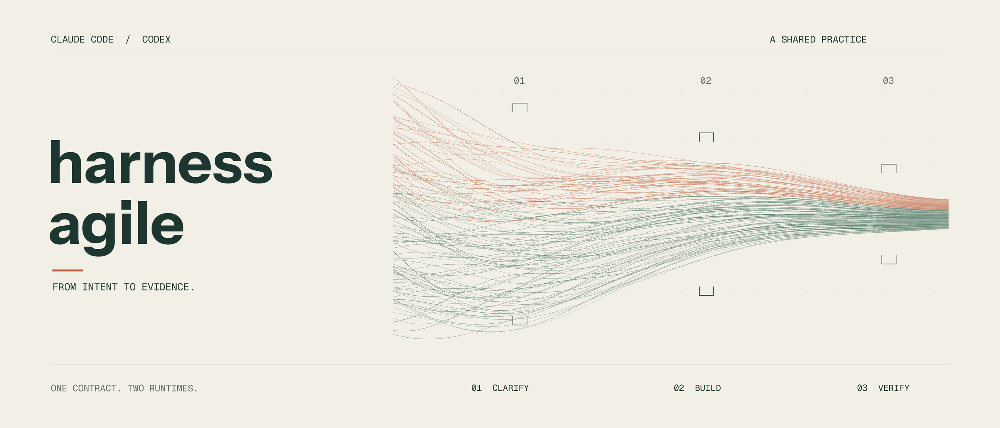

# harness-agile



[](https://github.com/CXPhoenix/harness-agile/actions/workflows/verify.yml)
[](https://github.com/CXPhoenix/harness-agile/tree/v0.2.0)
[](https://github.com/CXPhoenix/harness-agile/blob/main/pyproject.toml)
[](docs/agents/runtime.md)

**讓 Claude Code 與 Codex 沿用同一份需求、規格與交付紀錄。**

繁體中文 · [English](README.en.md)

harness-agile 是一份可攜的 AI 協作開發範本。從釐清需求到合併變更，每一步都有工作指引、產出與檢查條件；換工具或交接時，下一位開發助理可以接著同一份紀錄工作。

適合想把 AI 開發流程納入 Git、需要在 Claude Code 與 Codex 之間交接的個人或團隊。範本提供協作骨架，產品的技術棧與功能由你決定。

## 你會得到什麼

- **一份共用規範。** `AGENTS.md` 保存專案目的與工作流程，兩套工具共用 skills 正本，各自保留原生工具與角色設定。
- **可追溯的交付紀錄。** 需求寫成 spec，驗收條件對應到 tickets；review、測試與尚未解決的問題一起留在 repository。
- **可搬移的專案。** 建立器攜帶範本資料，skills 支援相對 symlink 或完整副本，並記錄採用來源與內容 digest。

## 快速開始

準備 Git 與 uv，然後在新專案的父目錄執行：

```bash
uvx --from 'git+https://github.com/CXPhoenix/harness-agile.git@v0.2.0' \
  harness-agile init my-project --name '我的專案' \
  --one-liner '它要解決的問題。' --no-input
cd my-project
uv run --python 3.11 python scripts/verify-project.py
```

這會建立專案目錄、填入名稱與描述，並檢查協作設定。目標須不存在或為空，父目錄須已存在。指令使用固定 Git tag；若來源需要驗證，請先確認 Git 讀取權限。

接著在新目錄開啟 Claude Code 或 Codex，執行 `grill-with-docs`，定義 `AGENTS.md` 裡的 Project Charter：產品服務誰、解決什麼問題、必須做到什麼。名稱與一句話描述只是起點，尚未代表需求確認。

| 操作 | Claude Code | Codex |
| --- | --- | --- |
| 定義 Project Charter | `/grill-with-docs` | `$grill-with-docs` |
| 查看可用 skills | `/skills` | `/skills` |
| 審查變更 | `/code-review` | `$code-review` |

<details>
<summary>使用 npx 或 pnpx</summary>

需要 Node.js 18+，以及 Python 3.11+ 或 uv。

```bash
npx --yes --package='git+https://github.com/CXPhoenix/harness-agile.git#v0.2.0' \
  create-harness-agile init my-project --name '我的專案' \
  --one-liner '它要解決的問題。' --no-input
```

```bash
pnpx 'git+https://github.com/CXPhoenix/harness-agile.git#v0.2.0' \
  init my-project --name '我的專案' --one-liner '它要解決的問題。' --no-input
```

`pnpx` 也可換成 `pnpm dlx`。三個入口使用同一套 Python 初始化邏輯；這裡使用 Git 來源，並非 npm／PyPI 同名套件。Node 入口先尋找 Python，再使用 uv；可用 `HARNESS_PYTHON` 指定 Python 執行檔。

</details>

已複製 GitHub template、要從本機建立，或需要預覽與完整參數，請讀[採用指引](.tmpl.docs/adoption.md)。要請開發助理代為建立，提供 [INSTALL.md](INSTALL.md)、目標目錄、名稱與一句話描述即可。

## 從想法到交付

先完成 **walking skeleton**：讓最薄的一條產品路徑真正跑通，建立後續開發可用的接點。這是第 0 輪，免 spec 與規格 review；合併到 `main` 後，後續以 epic 交付可展示的增量。

```text
釐清需求 → spec＋追溯矩陣 → 四軸 review → tickets → TDD
        → code review → security review → 實際介面驗證 → 合併
```

使用者在需求共識、拆票及測試計畫等節點確認方向。每張 ticket 使用獨立分支；驗證必須涵蓋功能真正執行的介面。完整規則見[交付流程](docs/agents/workflow.md)，日常操作見[協作指南](docs/guide.md)。

## 文件導覽

| 你想做的事 | 從這裡開始 |
| --- | --- |
| 建立新專案、選擇初始化方式 | [採用指引](.tmpl.docs/adoption.md) |
| 使用 skills、換工具、交接工作 | [協作指南](docs/guide.md) |
| 讓開發助理執行建立程序 | [INSTALL.md](INSTALL.md)（英文） |
| 查閱流程、tracker、review 規則 | [共用規範](AGENTS.md)與[執行文件](docs/README.md) |
| 修改母範本、驗證變更 | [貢獻與維護](.tmpl.docs/contributing.md) |

## 開發與驗證

在尚未初始化的母範本中，使用 Python 3.11+：

```bash
python3 scripts/verify-project.py
python3 -m unittest discover -s tests -v
```

這些檢查涵蓋範本結構、skills 與初始化行為。產品功能測試由 walking skeleton 建立；CI badge 連結到遠端執行狀態，不代表新產品功能已通過驗證。

## 授權

本專案採用 [MIT License](LICENSE)。內附第三方 skills、字型與品牌素材保留各自的授權；適用範圍及來源見[第三方聲明](THIRD_PARTY_NOTICES.md)與[來源紀錄](docs/agents/skill-sources.json)。

<!-- TEMPLATE-DOCS:START -->
## 範本設計與歷程

[維護文件索引](.tmpl.docs/README.md)保存設計背景、研究、計畫與歷史驗證。預設初始化會移除這些資料、範本 banner 與英文 README，並將本頁改為產品 README；`--keep-template-files` 可保留範本文件。
<!-- TEMPLATE-DOCS:END -->

Windows 的 Archify 自動開啟功能已停用；圖表產生與驗證仍可使用，請手動開啟產物。詳見[停用範圍與驗證方式](docs/security/windows-opener.md)。
